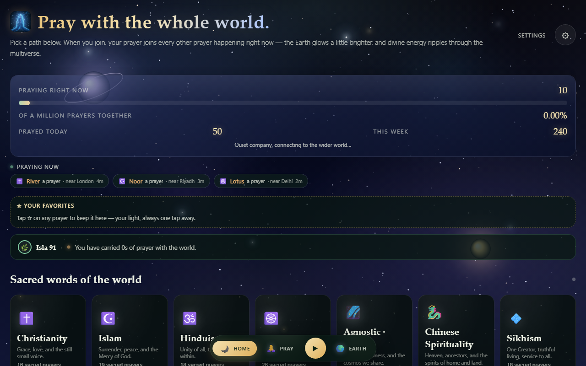

# Joining Palms

[](https://github.com/Jiansorge/prayer-earth/actions/workflows/test.yml)
[](https://joining-palms.app)
[](LICENSE)

**Pray with the whole world.** A multilingual, installable PWA where people of
every tradition pray together on one living Earth — live at
[`https://joining-palms.app`](https://joining-palms.app).

## Preview

> *Add a 5-sec screen recording to `public/demo.gif` and a screenshot to `public/screenshot.png` — they render here automatically.*




*Live is the demo — open `https://joining-palms.app`, pick a tradition, press Pray, and watch the Earth glow. Regenerate with `npm run capture:demo`.*

- 🌍 A real-time 3D Earth that glows as the world prays (WebGL shaders, prayer
  lights, a twinkling golden aura).
- 🙏 **145 prayers** across **15 traditions** — ancient public-domain scripture
  and original wholesome compositions. Everything is deliberately
  **non-copyrighted, non-dogmatic, and never shame- or sin-focused**.
- 🌐 **12 interface languages** (en, es, fr, de, hi, pt, it, ru, zh, ar, ja, ko)
  with RTL support for Arabic.
- 📱 Installable PWA, offline-ready via a service worker; works on phones and
  desktop.
- 🔒 Privacy-first: only a coarse 1° location cell is ever shared; no accounts,
  no precise location, no personal data. Raw IPs are never logged.

## Stack

| piece | tech |
|---|---|
| App | React 18, Vite, three.js, Zustand |
| Real-time sync | [`sync-engine`](https://github.com/Jiansorge/sync-engine) — Cloudflare Workers + Durable Objects (WebSocket presence, live feed, durable anonymous totals) |
| Voices | pre-rendered neural MP3s (`public/audio/`, `manifest.json`) + on-device TTS fallback |
| Install/offline | service worker (`public/sw.js`), Web App Manifest |
| CI | GitHub Actions: build + server tests + i18n audit on every push |

## Project

**Goal:** Manifest divine energy for the multiverse — a single, privacy-first place where anyone, of any tradition or none, can pray together and *see* the world light up.

* **World view (3D globe):** `three.js` + custom GLSL — equirect 2048×1024 land mask (Natural Earth 110m), correct `lon` chirality, cloud + aurora shaders, 256 instanced prayer lights with precomputed `localDir` (one `drawElements` pass, 60fps). Collective glow = `pow(count/1M, 0.38)` in `src/store.js`. Offline PWA via `public/sw.js`.
* **Prayers:** 15 traditions → 145+ prayers, code-split per spirit (`src/data/spirits/*.js` lazy via `loadSpirit()`), 12 locales with RTL, no copy-pasted copyrighted texts.
* **Sync:** App never talks to DB — only to `sync-engine` (Workers + Durable Objects) via tiny `src/sync/` interface. Swap `SyncEngine`→`CfEngine` with no app change.

## Private data

This repo is **public and contains zero secrets** — safe to share for job applications.

| What | How we handle it |
|---|---|
| **No accounts, no emails, no names** | Display name is user-chosen, stored only in `localStorage` (`prayer-earth-v1`), never required. |
| **Location** | Only a coarse **1° grid cell** (`gridKey`) derived from `navigator.geolocation` or timezone fallback; precise lat/lng never leaves device. Raw IPs never logged — upgrade throttle hashes IP with SHA-256. |
| **Prayer history** | `prayerCompletions`, `prayerDayStats` in `localStorage` only; anonymous counters merged via `mergeStats` (max-merge, no PII) to Durable Objects. |
| **Network** | Strict CSP (no `unsafe-inline`/`unsafe-eval`), `nosniff`, `DENY` framing, referrer policy; all feed content via React escaping (no `dangerouslySetInnerHTML`). |
| **Secrets** | None in repo — `VITE_SYNC_URL` is public `wss://joining-palms.app`, `wrangler.toml` vars are non-secret (`PROTOCOL_VERSION`, rate limits). Real tokens (`CF_API_TOKEN`, `ADMIN_KEY`) live in `wrangler secret` / GitHub Secrets, never committed. `.env*` is gitignored. |
| **Compliance** | GDPR-friendly: data stays on device; anonymous aggregates kept forever in DO storage + optional KV backup `TOTALS_BACKUP` for disaster recovery. See `sync-engine/docs/SECURITY.md`. |

> **For reviewers:** Clone, `npm install`, `npm start` — no keys needed. `npm run build` + `npm test` run fully offline.

## Development

```bash
npm install
npm start          # vite dev server (port 5173)
npm test           # server tests + usage checks
npm run test:proof # industrial proof: real-browser playback/earth/nav loops
npm run test:proof2
npm run audio      # render prayer MP3s (scripts/generate-audio.mjs)
```

In dev the app runs its own Node sync server so nothing needs Cloudflare until
you deploy.

## Content guidelines (please read before adding prayers)

Every prayer in this library is curated with care:

1. **Public domain or original.** No copyrighted texts — nothing modern whose
   rights are owned (e.g. no Bahá'í authorized translations, no 20th-century
   authored prayers). Ancient scripture and hymns (Bible, Qur'an, Vedas, Guru
   Granth Sahib, etc.) are fine; everything else is an original composition
   written for the app.
2. **Wholesome.** Nothing about being a sinner, no shame, guilt, or
   self-punishment, no fear-mongering.
3. **Respectful.** Indigenous and living traditions are represented with care
   and gratitude, never mocked or co-opted.
4. **Format.** See `src/data/prayers.js` — each prayer is an object with `id`,
   `title`, `lang`, `langLabel`, `phrases` (`{ t: spoken, s?: transliteration,
   e?: meaning }`), and a short `translation`. Add new MP3 audio with
   `npm run audio` (`AUDIO_PRAYERS=id1,id2` renders only those).

## Deployment

The app and the sync engine ship together from `sync-engine`:

```bash
cd ../sync-engine
npm run ship        # test → build app (cf engine) → stage → deploy
```

`npm run ship` rebuilds the app, stages it into the Worker's assets (with a
rollback backup), and deploys to `joining-palms.app`. Audio rides along; after
changing the MP3 library, bump `public/sw.js`'s cache version and purge the
Cloudflare `/audio/*` cache (see `sync-engine/docs/DEPLOYMENT.md`).

## Security & privacy

The app is privacy-first and hardened by default:

- **No accounts, no personal data** — only a coarse 1° location cell and
  anonymous counters ever leave a device; raw IPs are never logged.
- **Strict Content Security Policy** on the app shell (no inline scripts,
  no `unsafe-inline`/`unsafe-eval`), plus `nosniff`, `DENY` framing, and a
  referrer policy.
- **XSS-safe by construction** — all user/feed content renders through React's
  escaping (no `dangerouslySetInnerHTML`); display names are sanitized.
- **Server-side hardening** lives in the sync engine (origin checks, rate
  limiting, prototype-pollution stripping, constant-time secrets) — see
  [`sync-engine/docs/SECURITY.md`](https://github.com/Jiansorge/sync-engine/blob/main/docs/SECURITY.md).

See [`docs/PERFORMANCE.md`](docs/PERFORMANCE.md) for how the app stays fast,
including code-splitting, caching, and slow-device handling.

## License

App code is open source; prayer texts are public domain or original.
